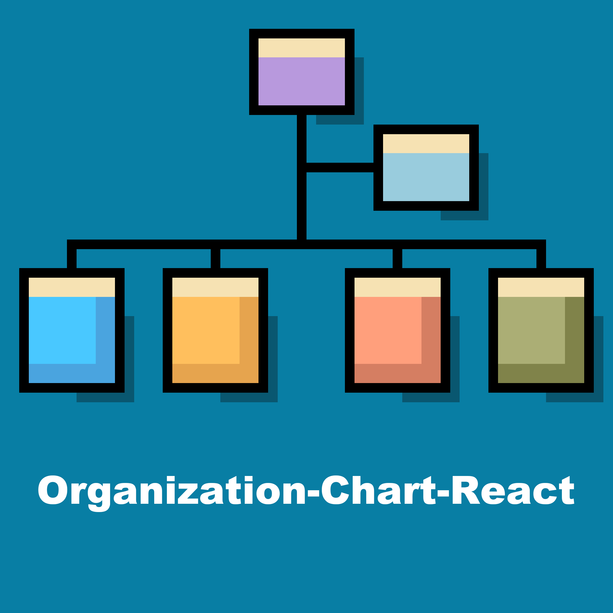

# Organization-Chart-React

[](https://www.npmjs.com/package/organization-chart-react)

> A lightweight, interactive organization chart component for React with collapsible nodes, TypeScript types, custom renderers, and selection events.

Organization Chart React renders hierarchical team and company structures with
no runtime dependency beyond React. It supports expandable branches, custom
node and member content, stable tree paths, and typed selection payloads.

## Features

- Interactive, accessible expand and collapse controls
- Generated TypeScript definitions for props, nodes, members, and events
- Custom `renderNodeTitle` and `renderMember` functions
- Typed `onSelect` payloads with stable IDs and complete tree paths
- Immutable input data and persistent expand state
- React and React DOM 18.2 through 19
- Themeable CSS variables and reduced-motion support

## Live demo

[Try Organization-Chart-React](https://leejams.github.io/Organization-Chart-React/)



## Install

Minimum supported versions: React and React DOM `18.2.0`.

```bash
npm install organization-chart-react
```

## Basic usage

```tsx
import { useState } from "react";
import OrganizationChart from "organization-chart-react";
import "organization-chart-react/style.css";
import type {
  OrganizationChartNode,
  OrganizationChartSelectPayload,
} from "organization-chart-react";

const orgData: OrganizationChartNode = {
  id: "company",
  title: "CEO",
  member: [
    {
      id: "oliver",
      name: "Oliver",
      add: "Chief Executive Officer",
    },
  ],
  children: [
    {
      id: "engineering",
      title: "Engineering",
      member: [{ id: "emma", name: "Emma", add: "CTO" }],
      children: [{ id: "frontend", title: "Frontend" }],
    },
  ],
};

export default function TeamChart() {
  const [selection, setSelection] =
    useState<OrganizationChartSelectPayload | null>(null);

  return (
    <>
      <OrganizationChart
        data={orgData}
        onSelect={setSelection}
        onClickNode={(node) => console.log("legacy node callback", node)}
      />
      <p>{selection?.path.join(" / ")}</p>
    </>
  );
}
```

The preferred stylesheet path is `organization-chart-react/style.css`.
`organization-chart-react/dist/style.css` remains available for compatibility.

## Props

| Prop | Type | Default | Description |
| --- | --- | --- | --- |
| `data` | `OrganizationChartNode` | required | Root organization node |
| `defaultExpandAll` | `boolean` | `true` | Initial expanded state for every branch |
| `onSelect` | `(payload) => void` | — | Recommended typed node/member selection callback |
| `onClickNode` | `(node) => void` | — | Legacy callback; receives the containing node |
| `renderNodeTitle` | `(props) => ReactNode` | — | Custom node-title renderer |
| `renderMember` | `(props) => ReactNode` | — | Custom member-row renderer |
| `className` | `string` | — | Additional class on the chart root |
| `ariaLabel` | `string` | `"Organization chart"` | Accessible label for the chart |

## Selection payload

`onSelect` is the recommended selection API:

```ts
interface OrganizationChartSelectPayload {
  kind: "node" | "member";
  node: OrganizationChartNode;
  member?: OrganizationChartMember;
  id?: string;
  path: string[];
}
```

- Selecting a node title emits its node, optional ID, and node path.
- Selecting a member emits the containing node, member, resolved ID, and member
  path.
- `onClickNode` is kept for existing React integrations. It always receives
  the containing node, including when a member row is selected.

## Custom renderers

Render functions receive typed context without changing the original data:

```tsx
<OrganizationChart
  data={orgData}
  renderNodeTitle={({ node, depth }) => (
    <span>
      {depth + 1}. {node.title}
    </span>
  )}
  renderMember={({ member }) => (
    <span>
      <strong>{member.name}</strong>
      <small>{member.add}</small>
    </span>
  )}
/>
```

`renderNodeTitle` receives `{ node, depth, path }`.
`renderMember` receives `{ node, member, depth, path }`, where `path` identifies
the containing node. The `onSelect` member payload includes the full member path.
Return presentational content such as text, images, and layout elements. Both
renderers are placed inside the component's accessible selection buttons, so
they should not return nested links, buttons, or form controls.

## Data shape

```ts
interface OrganizationChartMember {
  id?: string;
  name?: string;
  add?: string;
  image_url?: string;
  [key: string]: unknown;
}

interface OrganizationChartNode {
  id?: string;
  title: string;
  member?: OrganizationChartMember[];
  children?: OrganizationChartNode[];
  titleClass?: string | string[];
  contentClass?: string | string[];
  [key: string]: unknown;
}
```

IDs are optional but recommended. Stable node and member IDs preserve expand
state and selection paths when AI-generated or server-provided data is inserted,
removed, or reordered. IDs should be unique among siblings; the complete parent
path keeps matching IDs in separate branches independent. Without IDs,
deterministic position-based paths are used.

## Styling and themes

The component ships a complete default theme. Override variables on the chart or
a parent element:

```css
.company-chart {
  --org-surface: #ffffff;
  --org-surface-subtle: #f6f8fb;
  --org-title-bg: #172554;
  --org-title-color: #ffffff;
  --org-text: #1e293b;
  --org-text-muted: #64748b;
  --org-border: #dbe3ef;
  --org-line: #aebdd2;
  --org-accent: #2563eb;
  --org-focus: #2563eb;
}
```

```tsx
<OrganizationChart className="company-chart" data={orgData} />
```

Use `titleClass` and `contentClass` on individual nodes for team-specific
styling. Host wide charts inside a container with `overflow-x: auto`.

## Development

This repository uses the same reproducible package flow as
Organization-Chart-Vue3:

```bash
npm install
npm run typecheck
npm test
npm run build
npm run build-demo
npm run check:pack
```

- `npm run build` cleans and generates the library bundle, CSS, and declarations.
- `npm run build-demo` writes the GitHub Pages site to `docs/`.
- `npm run check` runs type checking, tests, the package build, and a dry-run
  package inspection, including NodeNext ESM and CommonJS consumer types.
- Node `20.19.0` or `22.13.0` and later compatible releases are recommended for
  local development with Vite 8.

Copyright (c) 2023-present, [LeeJam](https://leejams.github.io/)
